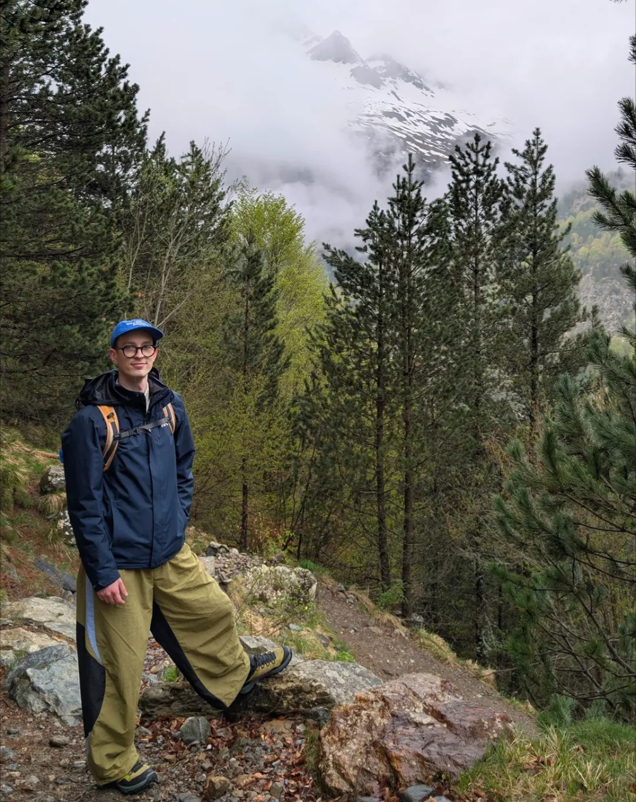

:::: {.columns .homepage-intro}

::: {.column width="32%"}

{.profile-picture width=200px}
:::

::: {.column width="68%"}

# Hello!

Welcome to my webpage! I am currently a PhD candidate in mathematics / probability at INRIA in the MATHNET Team under the supervision of <a href="https://www.di.ens.fr/~blaszczy/" target="_blank">Bartek Blaszczsyn</a> (INRIA) and  <a href="https://ieeexplore.ieee.org/author/37313658200" target="_blank"> Julien de Rosny <a/> (Institut Langevin). My PhD is funded by the  PSL Grand Projet <a href=https://www.smartwaves.psl.eu/en target="blank">Smart Waves <a/> under the name <a href=https://www.smartwaves.psl.eu/en/projects/smart-waves-2025-geosto4ris target="blank">"GeoSto4RIS"<a/>.

I work on probabilistic models arising in wireless networks. Currently my research focuses on continuum percolation and their applications to telecommunications.

  <a href="mailto:simon.steinlin@inria.fr">Email</a>
  ·
  <a href="https://github.com/Zetsy0" target="_blank">GitHub</a>
  ·
  <a href="files/cv_french.pdf" target="_blank">CV</a>

:::

::::